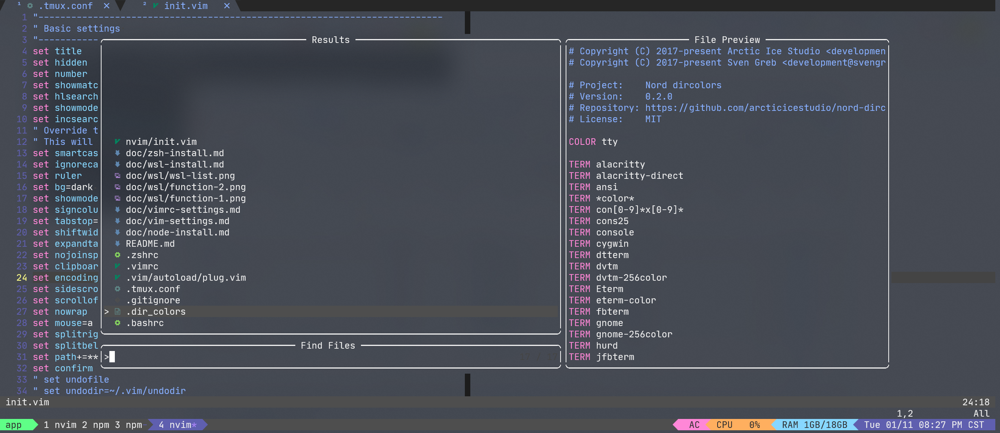

# dotfiles

## Install
Managing my dotfiles with GNU Stow

### Install stow
```
# ubuntu
apt install stow

# macOS
brew install stow
```

### Install dotfiles config

```
git clone git@github.com:byodian/dotfiles.git ~/.dotfiles
cd ~/.dotfiles
chmod +x install ubuntu
./ubuntu
```

### Remove dotfiles config
```
cd ~/.dotfiles
chmod +x clean-env
./clean-env
```

## nvim setup
要求 Neovim (>= 0.6)

- [nvim-lspconfig](https://github.com/neovim/nvim-lspconfig) - It provides common configuration for various language servers
- [nvim-cmp](https://github.com/hrsh7th/nvim-cmp) - About A completion plugin for neovim coded in Lua.
- [mason.nvim](https://github.com/williamboman/mason.nvim) -  Easily install and manage LSP servers, DAP servers, linters, and formatters.
- [telescope.nvim](https://github.com/nvim-telescope/telescope.nvim) - fuzzy finder
- [trouble.nvim](https://github.com/folke/trouble.nvim) - A pretty diagnostics
- [LuaSnip](https://github.com/L3MON4D3/LuaSnip) - Snippet Engine
- [nvim-treesitter](https://github.com/nvim-treesitter/nvim-treesitter) - Nvim [Treesitter](https://github.com/tree-sitter/tree-sitter) configurations and abstraction layer
- [nvim-web-devicons](https://github.com/kyazdani42/nvim-web-devicons) - A file type icons plugin
- [vim-repeat](https://github.com/tpope/vim-repeat) - Enable repeating supported plugin maps with "."
- [vim-textobj-user](https://github.com/kana/vim-textobj-user) - Create your own text objects
- [vim-surround](https://github.com/tpope/vim-surround) - Delete/change/add parentheses/quotes/XML-tags/much more with ease
- [vim-unimpaired](https://github.com/tpope/vim-unimpaired) - Pairs of handy bracket mappings
- [toggleterm.nvim](https://github.com/akinsho/toggleterm.nvim) - Help easily manage multiple terminal windows

## Fish Shell setup(macOs & Linux)
- [nerd-fonts](https://github.com/ryanoasis/nerd-fonts)
- [Fish shell](https://fishshell.com/)
- [fisher](https://github.com/jorgebucaran/fisher) - A plugin manager for Fish
- [tide](https://github.com/IlanCosman/tide) - The ultimate Fish prompt
- [autopair.fish](https://github.com/jorgebucaran/autopair.fish) - Auto-complete matching pairs in the Fish command line
- [fzf.fish](https://github.com/PatrickF1/fzf.fish) - Augment your fish command line with fzf key bindings
- [plugin-git](https://github.com/jhillyerd/plugin-git) - Git plugin for Oh My Fish (similar to oh-my-zsh git)
- [nvm.fish](https://github.com/jorgebucaran/nvm.fish) - Node.js version manager lovingly made for Fish
- [z for fish](https://github.com/jethrokuan/z)

## Powershell setup(Windows)
- [scoop](https://scoop.sh/) - A command-line installer
- [Git for Windows](https://gitforwindows.org/) - Focuses on offering a lightweight, native set of tools
- [Oh My Posh](https://ohmyposh.dev/) - A command-line installer
- [Terminal Icons](https://github.com/devblackops/Terminal-Icons) - A command-line installer
- [PSReadLine](https://docs.microsoft.com/en-us/powershell/module/psreadline/?view=powershell-7.2) - Cmdlets for customizing the editing environment, used for autocompletion
- [z for powershell](https://www.powershellgallery.com/packages/z/1.1.13) - Directory jumper
- [PSFzf](https://github.com/kelleyma49/PSFzf) - Fuzzy finder

## Command-line
### Basic Usage
- find
- grep
- ack
- sed
- xargs
- sort
- tr
- du
- df
- curl

### Advanced Usage
- [fd](https://github.com/sharkdp/fd)
- [fzf](https://github.com/junegunn/fzf)
- [exa](https://github.com/ogham/exa)
- [bat](https://github.com/sharkdp/bat)
- [htop](https://github.com/htop-dev/htop)
- [tldr](https://github.com/tldr-pages/tldr)
- [tmux](https://github.com/tmux/tmux)
- [stow](https://github.com/aspiers/stow)
- [tig](https://github.com/jonas/tig)

## Alacritty
Migrate Alacritty Configuration from YAML to TOML for > 0.13.x versions

```
alacritty migrate
```

## How to use 
- [How to (neo)vim](./doc/vim-settings.md)
- [How to use ohmyzsh](./doc/zsh-install.md)
- [How to use powershell](./doc/powershell.md)

## References
- [VIM中文帮助](https://yianwillis.github.io/vimcdoc/doc/help.html)
- [How to set up Neovim 0.5 + Modern plugins (LSP, Treesitter, Fuzzy finder, etc)](https://blog.inkdrop.app/how-to-set-up-neovim-0-5-modern-plugins-lsp-treesitter-etc-542c3d9c9887)
- [Neovim and Tmux for JavaScript Development](https://elijahmanor.com/blog/neovim-tmux)
- [Vimrc Configuration Guide - How to Customize Your Vim Code Editor with Mappings, Vimscript, Status Line, and More](https://freecodecamp.org/news/vimrc-configuration-guide-customize-your-vim-editor)
- [Comparison to other LSP ecosystems (CoC, vim lsp, etc.)](https://github.com/neovim/nvim-lspconfig/wiki/Comparison-to-other-LSP-ecosystems-(CoC,-vim-lsp,-etc.))
