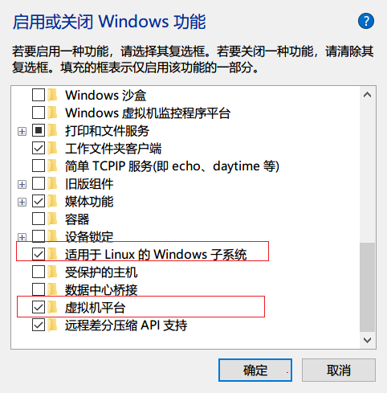
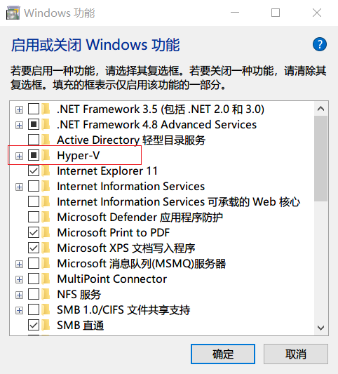
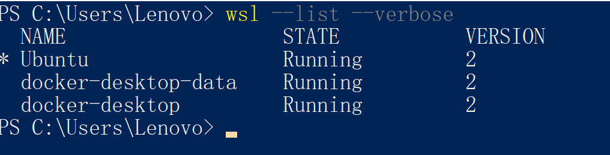

# windows Terminal

## WSL 2 介绍

**[什么是适用于 Linux 的 Windows 子系统？](https://docs.microsoft.com/zh-cn/windows/wsl/about)**

## 安装 WSL 2 步骤

### 一、启用 windows 功能

通过 PowserShell 命令或者 “设置” 开启相关的 **Windows 功能**。

需要开启的计算机功能有以下三个，同时还需要确保开启计算机 BIOS 虚拟化支持（一般是 BIOS 的 Intel Virtual Technology 选项），这里请自行搜索当前型号计算机的开启方式。

- Hyper-V （WSL 2）
  
    这一步的目的是可以在 Windows 10 上创建虚拟机，另外还需要确保开启计算机 BIOS 虚拟化。Hyper-V 作为可选功能内置于 Windows ，支持的操作系统版本为企业版、专业版和教育版。参考 **[在 Windows 10 上安装 Hyper-V](https://docs.microsoft.com/zh-cn/virtualization/hyper-v-on-windows/quick-start/enable-hyper-v)。**
    
    如果你的操作系统为家庭版，则需要手动安装 Hyper ，参考 **[Win10家庭中文版安装Hyper-V](https://zhuanlan.zhihu.com/p/356396288)。**
    
    **手动安装步骤：**
    
    1. **将如下代码添加到记事本中，并另存为Hyper-V.cmd文件**
       
        ```powershell
        pushd "%~dp0"
        dir /b %SystemRoot%\servicing\Packages\*Hyper-V*.mum >hyper-v.txt
        for /f %%i in ('findstr /i . hyper-v.txt 2^>nul') do dism /online /norestart /add-package:"%SystemRoot%\servicing\Packages\%%i"
        del hyper-v.txt
        Dism /online /enable-feature /featurename:Microsoft-Hyper-V-All /LimitAccess /ALL
        ```
        
    2. 找到Hyper-V.cmd文件图标，在右键菜单中点击：以管理员身份运行
    3. 然后后续按命令提示执行相应的操作
- 适用于 Linux 的 Windows 子系统
- 虚拟机平台

**通过 “设置” 启用**

使用 Windows 徽标 + s 快捷建搜索 **“启用或关闭Windows 功能”，**然后打开相应的功能。





**通过命令设置**

首先使用管理员身份打开 PowserShell，复制对应的命令。

1. 开启**适用于 Linux 的 Windows 子系统** (Enable the Windows Subsystem for Linux)
   
    ```powershell
    dism.exe /online /enable-feature /featurename:Microsoft-Windows-Subsystem-Linux /all /norestart
    ```
    
2. 开启**虚拟机平台** (Enable Virtual Machine feature）
   
    ```powershell
    dism.exe /online /enable-feature /featurename:VirtualMachinePlatform /all /norestart
    ```
    
3. 开启 **Hyper-V**
   
    ```powershell
    Enable-WindowsOptionalFeature -Online -FeatureName Microsoft-Hyper-V -All
    ```
    

### 二、下载 Linux 内核更新包（**Download the Linux kernel update package**）

1. [适用于 x64 计算机的 WSL2 Linux 内核更新包](https://wslstorestorage.blob.core.windows.net/wslblob/wsl_update_x64.msi)
2. 运行上一步中下载的更新包。 （双击以运行 - 系统将提示你提供提升的权限，选择“是”以批准此安装。）
3. 安装完成后，请继续执行下一步 - 在安装新的 Linux 分发时，将 WSL 2 设置为默认版本。

### 三、 **将 WSL 2 设置为默认版本**

打开 PowerShell，将 WSL 2 设置为默认版本：

```powershell
wsl --set-default-version 2
```

### 四、安装 Linux 分发

打开 [Microsoft Store](https://aka.ms/wslstore)，并选择你偏好的 Linux 分发版。

### 五、安装 Windows 终端

使用 Windows 终端可以打开多个选项卡或窗口窗格，以显示多个 Linux 发行版或其他命令行（PowerShell、命令提示符、Azure CLI 等）并在它们之间快速切换。 可使用独特的配色方案、字体样式、大小、背景图像和自定义键盘快捷键来完全自定义终端。 [了解详细信息。](https://docs.microsoft.com/en-us/windows/terminal)

[安装 Windows 终端](https://docs.microsoft.com/zh-cn/windows/terminal/install)。

### 其他问题

如果你的**安装步骤是先安装 Linux 发行版，再更新 WSL2**，则需要手动将 linux 发行版指定到 wsl 2 下运行。请使用管理员权限打开 PowerShell 执行以下命令：

1. 打开获取 WSL 版本和 Linux 发行版名称信息 (check the WSL version)
   
    ```powershell
    wsl --list --verbose
    ```
    
    
    
    **NAME** 为 Linux 发行版的名称，**VERSION** 为 WSL 的版本
    
2. 更改指定分发的版本 （To set a distribution to be backed by either version of WSL please run）
   
    ```powershell
    # wsl --set-version <distribution name> <wslversionNumber>
    wsl --set-version Ubuntu 2
    ```
    
    该命令的 `<distribution name>` 和 `<wslversionNumber>` 参数必须是通过第一步获取的 **NAME 和 VERSION** 值。
    
    ## 参考
    
    - [https://docs.microsoft.com/en-us/windows/wsl/install-manual](https://docs.microsoft.com/en-us/windows/wsl/install-manual)
    - [https://docs.microsoft.com/en-us/windows/wsl/install](https://docs.microsoft.com/en-us/windows/wsl/install)
    - **[Troubleshooting Windows Subsystem for Linux](https://docs.microsoft.com/en-us/windows/wsl/troubleshooting#error-0x80370102-the-virtual-machine-could-not-be-started-because-a-required-feature-is-not-installed)**
    - **[Windows 10 上的 Hyper-V](https://docs.microsoft.com/zh-cn/virtualization/hyper-v-on-windows/)**
    - **[How to Set Linux Distribution version to WSL 1 or WSL 2 in Windows 10](https://www.tenforums.com/tutorials/164318-how-set-linux-distribution-version-wsl-1-wsl-2-windows-10-a.html#:~:text=1%20Open%20an%20PowerShell.%202%20Copy%20and%20paste,You%20can%20now%20close%20PowerShell%20if%20you%20like.)**
    - [旧版 WSL 的手动安装步骤](https://docs.microsoft.com/zh-cn/windows/wsl/install-manual)